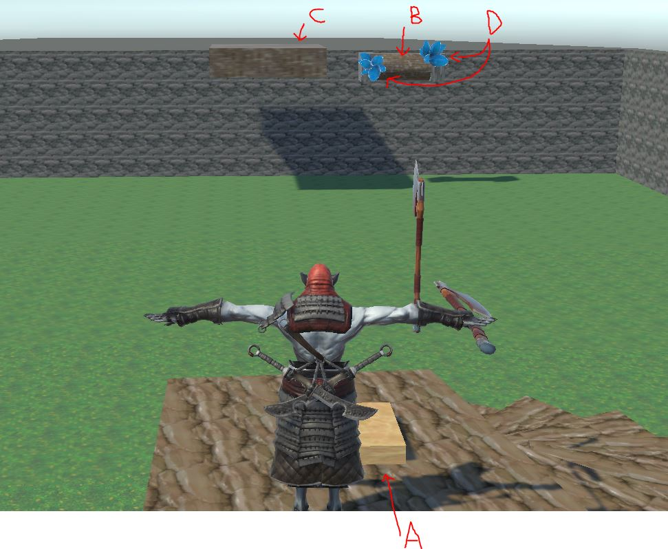

# Unity Testing 2021: God of War Demo

Unity Version: 2021.1.16f1
Youtube video talking about the demo: ([Youtube Link](https://youtu.be/Ix8kvoW7kLM))

The Unity Testing folder contains an older version before upgrading to the URP to add VFX. The latest version of the project is contained in ShaderTesting_URP. The content is a work in progress but shows a vertical slice of the content that may be interesting for others to view.

This project contains a small selection of partial work in Unity to test some newer frameworks and become more familiar with existing frameworks. The primary example in this demo is a simple recreation of a mechanic from God of War. In the God of War game, the player would interact with an object to make something move and then throw their axe at the rotating part to cause the motion, therefore, holding it in place. Then the player could move to a location that was otherwise unavailable before recalling their axe to complete the sequence.

The demo makes use of the following features:
* **Unity Universal Render Pipeline (URP)**: Used to provide many core visual elements. 
* **ProBuilder**: To make the simple room used by the player.
* **Cinemachine**: For 3rd person camera control.
* **Shader Graph**: For a custom texture-on-texture effect to create a freezing effect.
* **Visual Effect Graph**: For a custom snowing effect when crystals shatter.
* **Mixamo Model**: An imported Mixamo model with simple blend tree animation and character controller.
* **Other Models/Textures**: All other models and textures have been sources from the unity store or other locations, but all the scripts and configuration in the actual scene are my work.

## Use of the Observer Model

The scene is reliant on the observer model to decouple object dependency. The image below shows the important scene objects related to events.

The objects are as follow:
* A: A button that moves down when the player is on it. When entering or exiting the button, an event is fired to signal to observers that the button was triggered.
* B: A roller that observes the button state. When it receives a signal from the button, the roller will rotate as long as the button remains down. If the button is no longer down at any point, it will rapidly rotate back the other way. The roller has two events that let observers listen for it freezing and unfreezing. The freeze is handled when the axe hits or leaves the roller via a toggle.
* C: A moving platform that moves its position scaled based on listening to the percent of rolling progress performed by the roller B. This listening to percent of rotation means the platform will freeze automatically when the roller is frozen.
* D: Two icicles that appear when the freeze is triggered. The two icicles grow over time, while a custom shader on the roller also applies change based on freezing to create a combined effect. When the unfreeze event comes through, the shader reverses. And the two icicles shatter by fading out quickly and spawning a snowflake effect with the visual shader graph.
